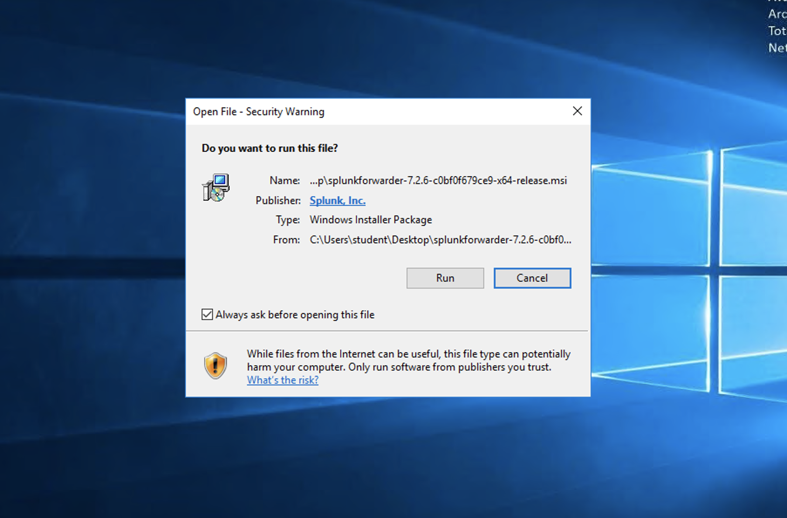
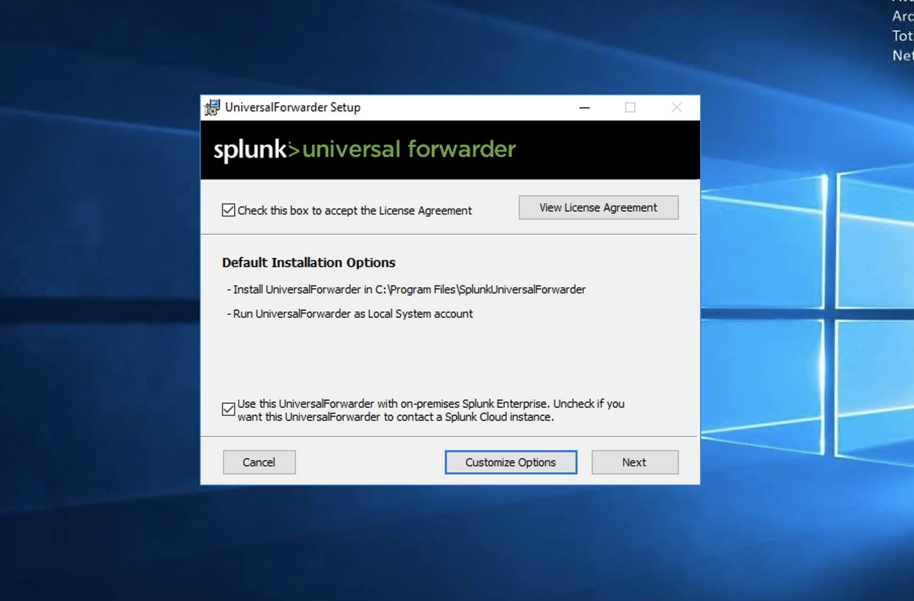
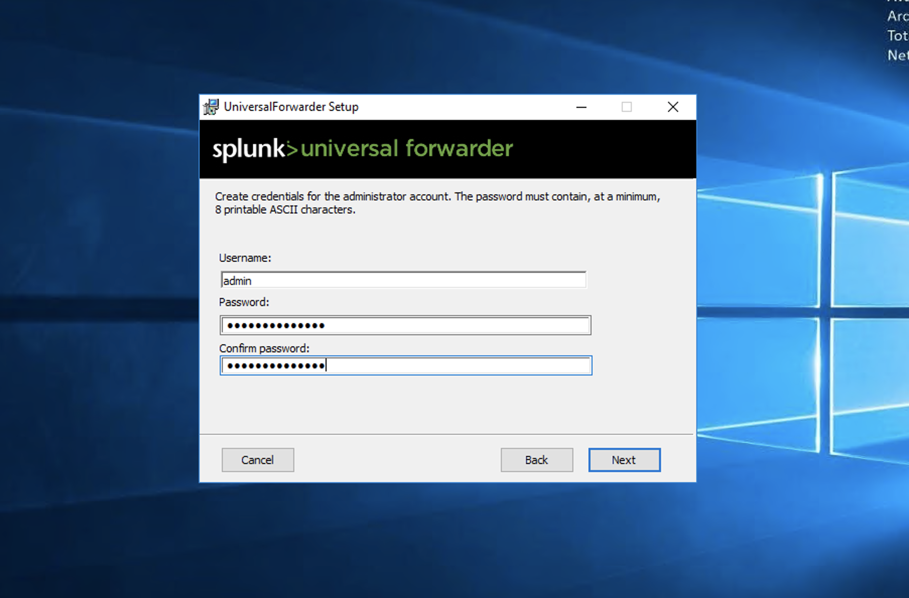
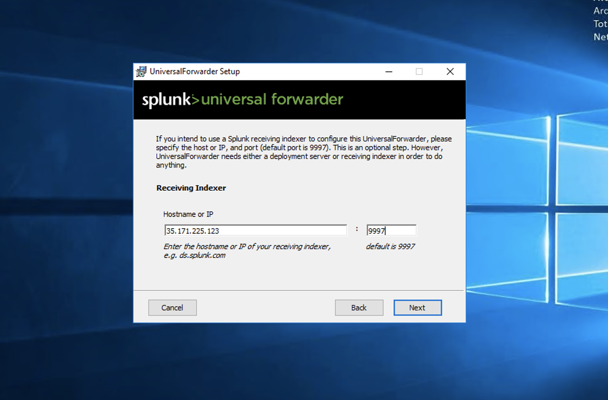
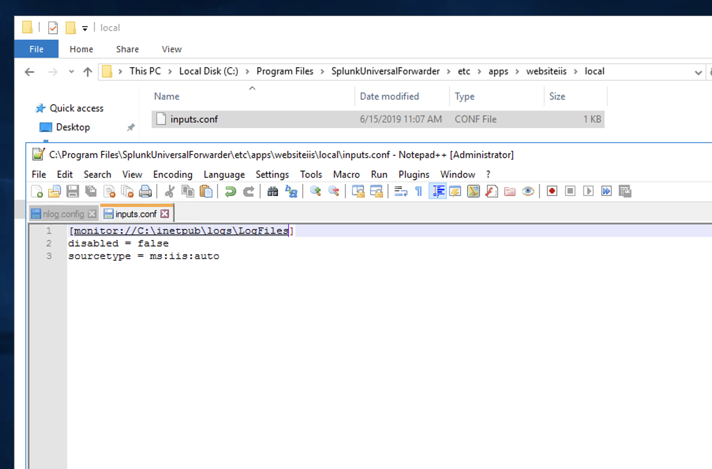
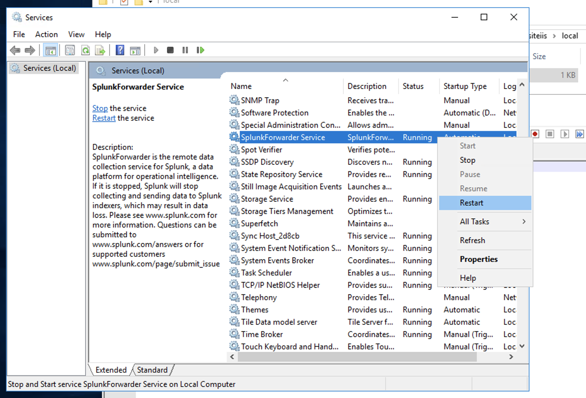
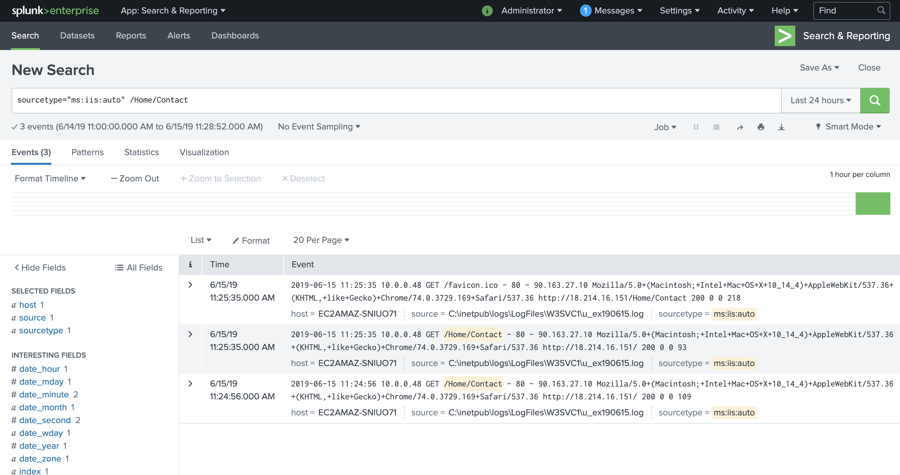
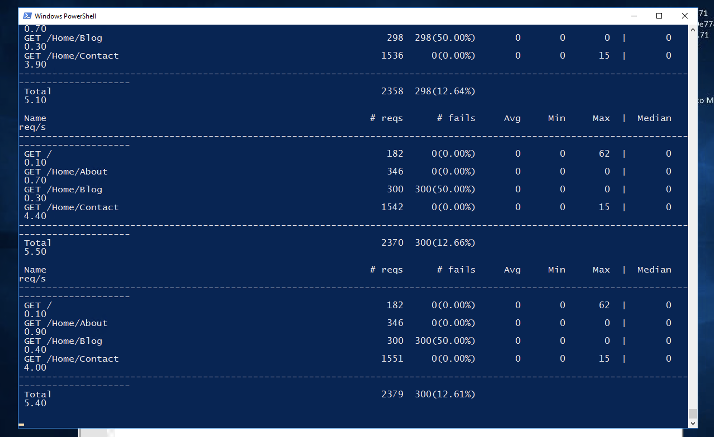

# IIS Logs to Splunk
Time: 1 Hour

## Instructions
As a final lab, you'll now configure a typical scenario when using Splunk. You'll install and configure an IIS server and then the Splunk forwarder to collect logs in Splunk. With this lab, you can apply everything you've learned so far.

### Enable a Data Receiver Port in Splunk Enterprise
By default, Splunk Enterprise isn't enabled to receive data from forwarders. So let's enable it:

- Go to "Settings > Forwarding and receiving"
- In the "Receive data" section, click on "Configure receiving"
- Click on "New Receiving Port"
- Type "9997" and then click on "Save"

### Install and Configure the Splunk Forwarder
The Splunk Universal Forwarder installer is located in the desktop server under the name of `splunkforwarder-7.2.6-c0bf0f679ce9-x64-release`. Double-click the installer icon and configure the installation following the wizard.

Click on the "Run" button when the installer asks you if you want to run the file:



Check the box for "Check this box to accept the License Agreement" and then click "Next"



Configure the credentials. Let's continue using the one we've been using for Splunk. Type `admin` for the username and `SplunkB00tcamp` for the password.



Skip the configuration for the deployment server and click "Next." On the next screen, you'll configure the receiver indexer—the Splunk instance that will receive the logs.

Type the Splunk server IP where you've been running searches, and type `9997` for the port.



Finally, click on "Install" and wait for the installation to finish. You'll be prompted to accept running the installation as an administrator user. Click on the "Run" button. When the installation has finished, click on the "Finish" button.

### Collect Data With the Splunk Forwarder
Let's create the configuration file to send IIS logs to Splunk. Create the `inputs.conf` file and the folder structure in the Splunk home directory: for example, `C:\Program Files\SplunkUniversalForwarder\etc\apps\websiteiis\local`. The content of the file should be the following:

```
[monitor://C:\inetpub\logs\LogFiles]
disabled = false
sourcetype = ms:iis:auto
```

You should have something like the following screen:



Now, let's restart the Splunk forwarder agent. Open the `Services` tool, locate the `SplunkForwarder Service`, right-click on it, and click on "Restart." It will take some time.



Let's do a few calls to the IIS site. For example, in the `Contact` page at http://{{HOST}}/Home/Contact, make sure to replace the `{{HOST}}` word with the IP address of the IIS server. The idea is that you generate traffic and see how logs arrive to Splunk.

Go to the Splunk UI to start searching, and run a search like the following:

`sourcetype="ms:iis:auto" /Home/Contact`

You should see a few log entries:



### Extract Fields
You might have noticed that the data isn't friendly for searches in Splunk. Put into practice what you learned during the boot camp and `Extract New Fields` by building a regular expression using the UI. You can go back to the [lab #4](04.md) to remember how you did it.

Remember, one of the purposes of extracting fields is that you can create search queries that perform well when the data increases.

### What's Next? Simulation Time!
Here's where the fun begins. You'll now need to hammer the IIS server to generate enough traffic and then generate log entries to Splunk. There's a Python application that you can use in the server to generate traffic. Here's how to use it:

1. The files for load testing have been previously uploaded to the server. There should be a `loadtest` folder on the desktop. Open the folder, and you should see a few files.
2. Open a command prompt, like Powershell, and run the following command:

```
.\loadgen.ps1
```

3. If for some reason the script fails, just run it again. Even if you see an error in the output, leave it there. You should see the stats from the load test.



After you've generated enough traffic, let's practice what you've learned:

- Schedule a report with the top most visited paths (URLs) in the site
- Schedule a report with the top paths with a 404 status code
- Create a dashboard panel where you include the following:
    - The top five most visited paths
    - The top five paths with a 404 status code
    - A linear graphic distribution showing the traffic sent
    - A big number showing how many requests are being received per second
    - A search where you can see all the events from NGINX

### References
- https://www.nginx.com/blog/operational-intelligence-nginx-plus-splunk-enterprise/
